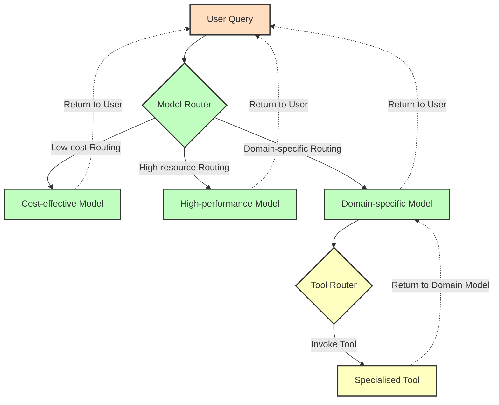

# Routers for LLM: A Framework for Model Selection and Tool Invocation

## Abstract

In the current landscape of large language models, users are confronted with a plethora of models and tools each offering a unique blend of specialisation and generality. This project proposes the development of a dynamic middleware “router” designed to automatically assign user queries to the most appropriate model or tool within a multi-agent system. By using zero-shot Natural Language Inference models, the router will evaluate incoming prompts against criteria such as task specificity and computational efficiency, and *route* the prompt to the most effective model and / or allow specific tools relevant that the model could use.

The proposed framework is underpinned by three core routing mechanisms. 

- Firstly, it will direct queries to cost effective yet sufficiently capable models, a concept that builds on existing work in semantic routing [https://arxiv.org/pdf/2406.18665].

- Secondly, it incorporates a tool routing system that automatic invocation of specialised functions, thus streamlining user interaction and reducing inefficiencies currently inherent in systems like OpenAI’s and Open Web UI. Furthermore this could also reduce inefficiencies in the recent reasoning models addressing the observed dichotomy between underthinking with complex prompts and overthinking with simpler queries when reasoning is manually toggled which can be costly and could cause hallucination.

- Thirdly, while the primary focus remains on model and tool routing, this work will preliminarily explore the potential application of the routing architecture as a security mechanism. Initial investigations will examine the theoretical feasibility of leveraging the router's natural language understanding capabilities to identify adversarial prompts. This includes a preliminary assessment of detection capabilities for prompt engineering attempts, potential jailbreaking patterns, and anomalous tool usage requests. However, given the rapidly evolving nature of LLM security threats and the complexity of implementing robust safeguards, comprehensive security features remain outside the core scope of this research. This aspect represents a promising direction for future work, particularly as the field of LLM security continues to mature.

By integrating these mechanisms, the research aims to pioneer a more efficient, modular, and secure distributed AI architecture. This architecture not only optimises resource allocation but also reinforces system integrity against emerging adversarial threats, thereby contributing novel insights into the development of next-generation LLM deployment strategies.

## Chapter 1: Introduction
In the past few years the landscape of large language models has expanded dramatically, with many domain specific as well as general-purpose agents emerging across domains such as healthcare (like Med-PaLM 2 and BioGPT), coding (like CodeLlama and GitHub Copilot), and research (like Claude Opus and GPT-4o). Organisations that provide inference as a service now face complex trade-offs between cost, latency, and capability: for example, GPT-4.5 can cost up to $75 per million tokens compared with just $0.15 for gemini-2.5-flash [https://sanand0.github.io/llmpricing/] . [https://artificialanalysis.ai/] . Although these models could be vastly different in terms of capability, the problem organisations face is determining *when* to deploy premium models versus more cost-effective alternatives for a given task / prompt. This suggests a need for intelligent routing systems that can analyse incoming prompts and direct them to the most appropriate model based on task complexity, required capabilities, and cost considerations. 

Inspired by lower level (transformer-embedded) "router" such as the one employed by mistral for their Mixtral (MoE) model the goal of this was to allow for a more distributed, higher level prompt based routing between a verity of models with varying levels of cost and complexity. 

### 1.2 Problem Statement
The proliferation of large language models has created a complex ecosystem where selecting the optimal model for a given task has become increasingly challenging. 

Existing multi-agent routing systems reveal several shortcomings. First, many current routers rely on **manual configuration**. For example, Both Open AI's as well as Open WebUI’s chat interface require explicitly toggling of tools/selection of agents from users, and listing models to skip, on a per-chat basis. This manual toggling is brittle. Second, LLM-based routers can suffer from reasoning **inefficiencies**. Recent studies identify _“underthinking”_ (prematurely abandoning good reasoning paths) and _“overthinking”_ (generating excessive, unnecessary steps) in modern LLMs. For instance, Wang _et al._ (2025) find that top reasoning models often switch thoughts too quickly – an _“underthinking”_ effect that hurts accuracy [https://arxiv.org/pdf/2501.18585v1]. Conversely, Kumar _et al._ demonstrate how even simple queries can be made to “overthink” (spending many tokens on irrelevant chains of thought) without improving answers [https://arxiv.org/pdf/2502.02542v1]. Both phenomena imply wasted tokens. Finally, prompt interpretation remains imperfect: ambiguous or poorly phrased queries may be misrouted or require multiple LLM calls to resolve intent, leading to inefficiency. In summary, while the potential of multi-agent LLM routing is clear, current systems often need extensive hand-crafting or suffer from model quirks. This gap motivates research into more autonomous, context-aware routing controllers – for example, combining zero-shot inference (NLI) with learned routing and feedback to minimise manual setup and handle under/overthinking systematically.
Organisations and users face several key problems:

1. **Cost-Efficiency Trade-offs**: High-capability models like GPT-4o and Claude 3 Opus provide powerful capabilities but at significantly higher costs than simpler models. Without intelligent routing, organisations and users may unnecessarily infer to expensive models for tasks that could be adequately handled by more cost-effective alternatives.

2. **Selection Complexity**: With the dawn of function calling and Multi-modal Context Processing (MCP), most chat systems offer numerous specialised tools and functions, but determining which tools are appropriate for a given query often requires manual specification by users or developers. While this might seem like a minor inconvenience for users interacting through visual interfaces (web, mobile apps), it creates significant limitations for systems accessed through voice interfaces or complex automated pipelines such as interacting via email. Current implementations typically rely on toggle switches within the user interface that many users forget to activate before submitting their queries. This oversight leads to situations where tools aren't utilised when they should be, resulting in responses that are hallucinated by the LLM rather than grounded in factual data. While this may be acceptable for general knowledge questions, it becomes problematic for mathematical calculations, queries about latest news or weather conditions, or specialised information such as device status checks (e.g., whether a smart bulb is on or off). The disconnect between available tools and their appropriate activation represents a significant usability challenge that an intelligent router could potentially resolve.

3. **Computational Resource Allocation**: Indiscriminate routing of all queries to high-performance models can lead to inefficient resource allocation, increased latency, and higher operational costs for LLM providers and users.

### 1.3 Research Objectives
The premise of this research is to investigate whether pre-existing Natural Language Inference models such as Facebook's bart-large-mnli could be used as drop-in replacements to perform automated model selection and tool selection. Furthermore, we will examine the effectiveness of fine-tuning existing NLI models with specialised datasets designed for routing tasks.

The specific research objectives include:
- Creating a LLM Router library that can be deploy to existing systems with ease.
- Experimenting with Pretrained NLI models such as bart-large-mnli  for both tool routing and model selection.
- evaluating and Assessing the accuracy the effectiveness using a set of prompts.
- Incorporate it with an existing Chatbot UI platform such as OpenWebUI.

## Chapter 2: Literature Review

### 2.2 Multi-Agent Systems and Distributed AI Architecture

Multi-agent systems (MAS) have been a subject of research and development since the 1980s. While traditional MAS research established fundamental principles by using  agent communication protocols such as KQML and FIPA-ACL, the emergence of Large Language Models has transformed how these systems operate in practice.

In December 2023, Mistral AI introduced Mixtral 8x7B, a model that employs a Sparse Mixture of Experts (MoE) architecture suggesting a promising approach which only activates a subset of a large model’s “experts” per query. Which have them the edge over other models in such as Llama 2 70B on most benchmarks where Inference was 6 times faster and even _“matches or outperforms GPT 3.5 on most benchmarks”_ [https://arxiv.org/abs/2403.12031]. While Mixtral applies routing at the model architecture level rather than through a separate system level orchestration, it demonstrated the potential for such a middle layer. This approach highlights how advanced modular designs can enhance performance, even though the computational requirements for inference remain high for many GPU it was significantly less expensive to run compared to similar sized dense models. This increased demand for performance optimisation while leveraging existing models remains at the core reason to research for systems that deploy sophisticated multi-model and multiagent systems.

### 2.1 Large Language Models: Current Landscape
Large scale LLMs continue to grow in parameter count and capability, intensifying the trade off between performance and computational cost. Models such as OpenAI’s GPT 4 and Google’s Gemini 2.5 Pro deliver top tier results, but at significantly higher inference costs often 400 to 600 times more than comparable alternatives [https://help.openai.com/en/articles/7127956-how-much-does-gpt-4-cost]. With many state of the art models being closed source (only accessible through an API), a new wave of open weight and open source models has emerged. These models make it easier for individuals and companies to self host, potentially lowering operational costs. For organisations offering inference as a service, open models are particularly advantageous not only for cost efficiency, but also for addressing privacy and security concerns associated with sending user prompts to third party providers. 
### 2.3 Semantic Routing Mechanisms
Several recent projects provide router like middleware to manage multi model access. one such is **OpenRouter.ai** which unified API that hides model providers behind a single endpoint, dynamically routing requests across providers to optimise cost and availability. On the open-source side, **RouteLLM** formalises LLM routing as a machine learning problem. RouteLLM learns from preference data such as chatbot arena rankings to send easy queries to cheap models and hard ones to big models. Their results show that such learned routers _“can significantly reduce costs without compromising quality, with cost reductions of over 85% on MT Bench while still achieving 95% of GPT-4’s performance”_ [https://lmsys.org/blog/2024-07-01-routellm]. Another routing mechanisms Router Bench shows promise with over 405,000 inference outcomes from representative LLMs, measuring routers on metrics such as dollar-per-token cost, latency, and accuracy. [https://arxiv.org/pdf/2403.12031]

On the tool routing sides of things most work focusing on enabling LLMs to call tools rather than on how to choose them automatically. Landmark papers like **Toolformer** [https://arxiv.org/pdf/2302.04761] demonstrate how LLMs can learn to invoke tools. At the interface level, OpenAI’s **Function Calling** and “built in tools” features have begun to infer tool usage directly from user prompts example: “google XYZ for me” automatically triggers a web search tool without explicit selection. In parallel, **LangChain** implement lightweight embedding based matching to decide when and which tools to invoke. Despite these advances, there remains a gap in formal publications on tool routing per se, especially in live inference settings.
### 2.4 Routing Approaches

Whilst looking for alternatives some of the current decision making mechanism used by LLM services are:

In evaluating alternatives, several decision making mechanisms currently used by LLM services are:
- **Rule-based routing:** This relies on a predefined set of heuristic rules or configuration files to map incoming queries to specific LLMs or tools. For example, simple keyword matching or regular expressions might be used. A terminal tool could apply a rule such as `/```bash\b/` to detect a Bash code block, then execute it in a virtual shell with appropriate safety checks. This approach offers full transparency and is reliable.[https://developers.liveperson.com/conversation-builder-generative-ai-routing-ai-agents-route-consumers-conversationally.html] Each routing decision is directly traceable to an explicit rule, making the system’s behaviour predictable and explainable. [https://aws.amazon.com/blogs/machine-learning/multi-llm-routing-strategies-for-generative-ai-applications-on-aws/] However, because it relies solely on hard patterns, it often lacks contextual understanding. For example, a prompt like `“Could you make me a simple Snake game in Pygame?”` may not activate a development tool if the trigger is based only on a regular expression like `/```python\b/`, which searches for explicit Python code blocks.  

- **Prompt-based routing:** This involves invoking a language model with a crafted system prompt. For example: `SYSTEM: “Determine whether the following prompt <USER_PROMPT> contains Bash. If so, return only the shell commands.”` The model’s response is passed to the relevant tool or agent. If a shell command is detected, it may be executed and its output returned to the user after post-processing. A simple approach for model selection is to prompt a compact but capable model, such as TinyLlama, with the query and a list of available models, and ask it to select the most appropriate one. LLM-based routers benefit from broad general knowledge and the ability to process complex inputs. However, they introduce higher computational overhead, latency, and occasional unreliability, making them expensive and potentially fragile.

- **Similarity Clustering based Routing:** This method uses leverages unsupervised clustering algorithms such as a K-means to group historical user queries in a semantic embedding space thereby identifying clusters of similar requests. By operating on semantic similarity rather than rigid rules, this method affords greater contextual sensitivity, enabling more flexible task appropriate routing while retaining the predictability of cluster‐level performance. This method is effective if the quality of the data collected is very high. [https://arxiv.org/pdf/2502.00409v2]

- **NLI-based (zero-shot) routing:** This is the approach we will implement. It employs a pre-trained Natural Language Inference model, such as BART-Large-MNLI, to perform zero-shot intent classification. The prompt is treated as the premise, while tool or agent descriptions are framed as hypotheses. The tool or agent with the highest scoring hypothesis is selected. This approach requires no additional training but is sensitive to the phrasing and calibration of the hypotheses. The quality of results thus depends heavily on how well these descriptions are constructed. This give us both the reliability of Rule-based routing whisht allowing the prompt to be flexible for some level of context relation. 
### 2.7 Research Gap Analysis


As highlighted previously multi-agent routing has been ### as well as sucessfully implemented prevously both as closed souce (openruter.ai) as well as in open souce libraries such as RouteLLM. ALthouth 


## Chapter 4: Methodology

### 4.1 Research Design
This study employs an experimental research design to develop and evaluate a prompt-to-topic routing system for large language models. Our approach draws from both software engineering methodologies and machine learning evaluation practices to create a systematic framework for development and testing. The research follows an iterative development methodology, beginning with the selection of a foundational Natural Language Interface (NLI) and progressing through the creation of increasingly sophisticated routing mechanisms. The ultimate goal is to produce a modular, extensible, and user-friendly Python library that can be integrated into various AI applications.

The methodology consists of seven distinct phases: (1) base model selection, (2) router prototype development, (3) library architecture design, (4) evaluation framework creation, (5) synthetic dataset generation, (6) user interface development, and (7) plugin integration with existing AI systems. Each phase builds upon the previous ones, with continuous evaluation and refinement throughout the process. This iterative approach allows us to incorporate findings from earlier stages into subsequent development, creating a feedback loop that strengthens the overall system design.

### 4.2 Base Model Selection

The initial phase involves selecting an appropriate foundation model to serve as the cognitive engine for the routing system. This selection process considers several critical factors that directly impact the viability and performance of the resulting system.

We evaluated candidate models against the following criteria:

1. **Classification Performance**: The model must demonstrate strong capabilities in text classification and categorization tasks, particularly in zero-shot and few-shot settings. We measured performance using standard metrics including F1 score, precision, and recall across a diverse set of classification tasks.
2. **Inference Speed**: Given that routing decisions must occur with minimal latency to maintain system responsiveness, we established maximum acceptable response time thresholds based on human perception studies. Models exceeding these thresholds were eliminated from consideration regardless of their performance on other metrics.
3. **Licensing Considerations**: Only models with permissive licensing terms suitable for both research and potential commercial applications were considered.

For the experimental evaluation, well select the open weights model: `facebook/bart-large-mnli`

### 4.3 Generic Prompt-to-Topic Router Development

Following model selection, we developed a prototype router capable of classifying incoming prompts into predefined topic categories. This prototype served as the foundation for subsequent development efforts and allowed us to establish baseline performance metrics. The router is accessible via the `llm_routers` library as the `Router()` class.

The fundamental design takes a dictionary style hash map within an array structure to define topics and their descriptions:
```python
TOPICS = [
    {"NEWS": "Breaking stories, current events, and latest headlines from around the world, updated in real-time."},
    {"Entertainment": "Latest updates on movies, music, celebrities, TV shows, and pop culture highlights."},
    {"Sports": "Live scores, match results, player updates, and coverage of major sporting events worldwide."}
]
topic_router = Router(TOPICS)
agent_router.route_query("Dr Who display extends hours to attract visitors")
agent_router
# >> ("Entertainment", 0.73494)
```

### 4.4 Python Library Development

The third phase transformed the prototype router into a well-structured, extensible Python library suitable for integration into various applications and workflows. This development followed software engineering best practices to ensure code quality, maintainability, and usability. The complete codebase is available at `https://github.com/ru4en/llm_routers` and can be installed via pip:

```
pip install git+https://github.com/ru4en/llm_routers.git
```
The library architecture implements the following design principles:
1. **Modular Component Structure**: The system is organised into three main components:
    - `Router`: The core classification engine that maps prompts to predefined topics with confidence scores
    - `AgentRouter`: A router that selects appropriate AI agents based on query requirements
    - `ToolRouter`: A router that matches queries to optimal tools for task completion
2. **Consistent API Design**: All router types implement two primary methods:
    - `route_query(user prompt)`: Routes a single prompt to the appropriate topic/agent/tool
    - `batch_route([user prompt,user prompt])`: Efficiently processes multiple prompts in a single operation
3. **Dynamic Configuration**: Each router provides candidate management functions:
    - `add_candidate(name, description)`: Dynamically expands the routing options
    - `remove_candidate(name)`: Removes options from the router's consideration set
4. **Performance Optimisations**: Several enhancements improve real-world deployment characteristics:
    - Batched processing for efficient handling of multiple requests
    - Asynchronous operation options via `async route_query()` 

The implementation includes comprehensive error handling, detailed logging to support easy integration into existing pipelines.
### 4.5 Evaluation Framework Creation

To facilitate adequate testing and performance measurement, I developed a simple testing and demo scripts that would use a set of "data" to enables systematic assessment of routing accuracy and computational efficiency across diverse scenarios whilst also allowing to try out the library.
#### Testing Script 

This tests against a set of synthetically generated prompts.  

```shell
python3 src/test/test.py
```
### Demo Script 

This lets the user interact with routers allowing them to input a prompt and predict a set agent and tools for the given prompt.

```shell
python3 src/test/demo.py
```
### 4.6 Synthetic Dataset Generation

Synthetic Dataset which is only used to demonstrate the fusibility of this module was generated using Chat GPT:

```python
agents = {
    "Adam": "Coder and Developer Agent – Specialises in Python and JavaScript development; creates scripts and applications.",
    "Eve": "Designer and Artist Agent – Expert in UI/UX and Graphics Design; produces content.",
...


tools = {
    "IDE": "Programming development environment for code editing",
    "Figma": "Design tool for creating UI/UX prototypes and graphics",
...

test_data = [
	{"query": "Write a Python application to track the stock prices and generate a report.",
    "expected_agent": "Adam",
    "expected_tools": ["IDE", "Terminal"],},

	{"query": "Design a new logo for the company.",
	"expected_agent": "Eve",
	"expected_tools": ["Figma"]},
...
```

### 4.8 Plugin Integration with Existing Systems

The final phase of the methodology focused on practical integration the Zero-Shot Router plugins with existing AI interfaces or platforms to demonstrate real-world applicability.

The three plugins for OpenWebUI:
	**Agent Router Plugin**: Routes arbitrary user queries to one of five specialised AI agents (Email, Code, Summariser, Chatbot, Sentiment-Analysis) based on task descriptions.
	**Tool Router Plugin**: Selects the most appropriate system tool that have already been installed  (e.g. web search, code interpreter, image generation) for each incoming user request.
	
### 4.2 System Architecture



### 4.3 Development of Router Components

#### 4.3.1 Model Router Development

#### 4.3.2 Tool Invocation Router Development

#### 4.3.3 Security Guardrail Router Development

### 4.4 Fine-Tuned Model

#### 4.4.1 Training Dataset 

#### 4.4.2 Synthetic Data For Testing
#### 4.4.2 Demonstration and Testing Scripts 
## Chapter 5: Model Router Implementation

### 5.1 Cost-Effectiveness Quantification

### 5.2 Domain Specificity Detection

### 5.3 Decision-Making Algorithms

### 5.4 Performance Analysis

### 5.5 Integration with Overall System

## Chapter 6: Tool Invocation Router Implementation

### 6.1 Tool Capability Mapping

### 6.2 Query Intent Classification

### 6.3 Automatic Tool Selection Algorithms

### 6.4 Tool Execution and Response Integration

### 6.5 Case Studies of Tool Router Efficiency

## Chapter 7: Security Guardrail Router Implementation

### 7.1 Threat Detection Mechanisms

### 7.2 Attack Pattern Recognition

### 7.3 Mitigation Strategies

### 7.4 Security Testing Results

### 7.5 Balance of Security and Usability

## Chapter 8: System Integration and Testing

### 8.1 Integration of Router Components

### 8.2 End-to-End System Architecture

### 8.3 Standardized Interfaces

### 8.4 Library Development for Chat Interfaces

### 8.5 Comprehensive System Testing

### 8.6 Benchmark Comparisons with Existing Solutions

## Chapter 9: Results and Analysis

### 9.1 Efficiency Improvements

### 9.2 Accuracy and Appropriateness of Routing Decisions

### 9.3 Security Enhancement Outcomes

### 9.4 Cost-Benefit Analysis

### 9.5 Limitations of the Current Implementation

## Chapter 10: Discussion

### 10.1 Implications for Multi-Agent LLM Systems

### 10.2 Scalability Considerations

### 10.3 Ethics and Privacy Considerations

### 10.4 Comparison with Related Work

### 10.5 Theoretical Contributions

### 10.6 Practical Applications


## Chapter 11: Conclusion

### 11.1 Summary of Findings

### 11.2 Research Contributions

### 11.3 Final Reflections

## References

## Appendices

### Appendix A: Technical Documentation

### Appendix B: Router Specifications

### Appendix C: Training Data Samples

### Appendix D: Test Suite Details

### Appendix E: Implementation Code